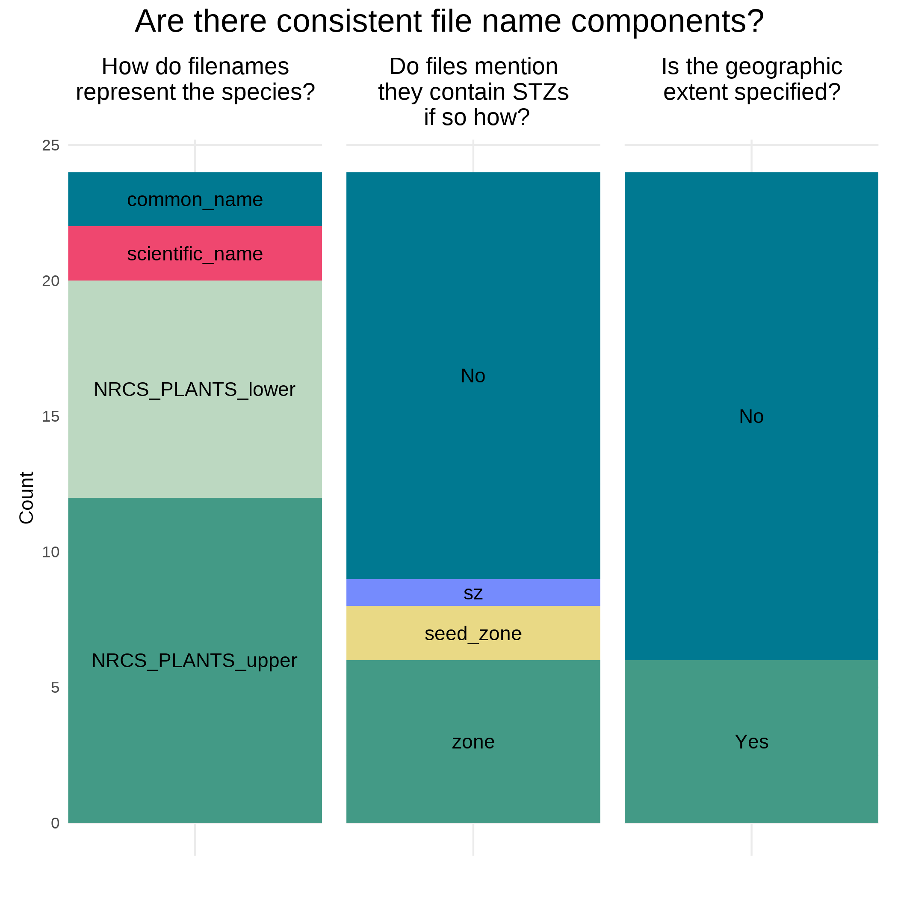
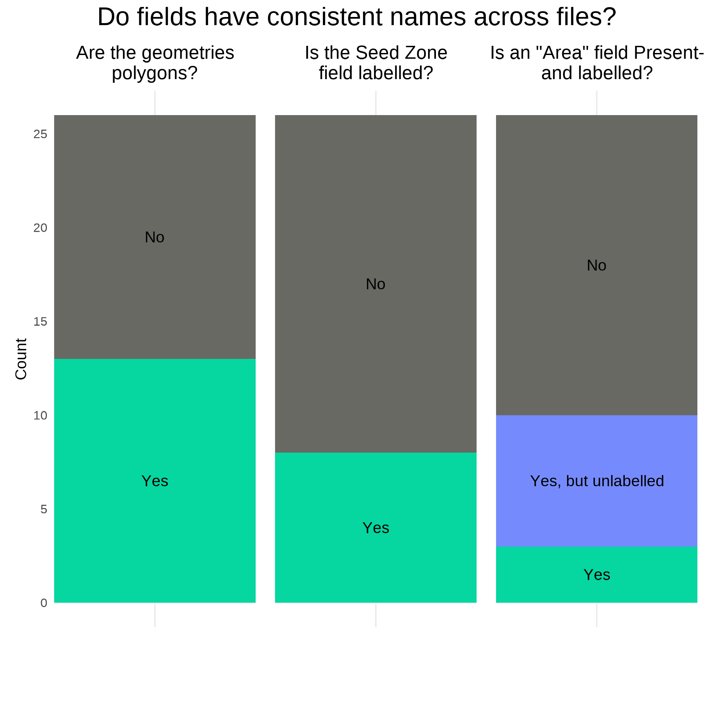
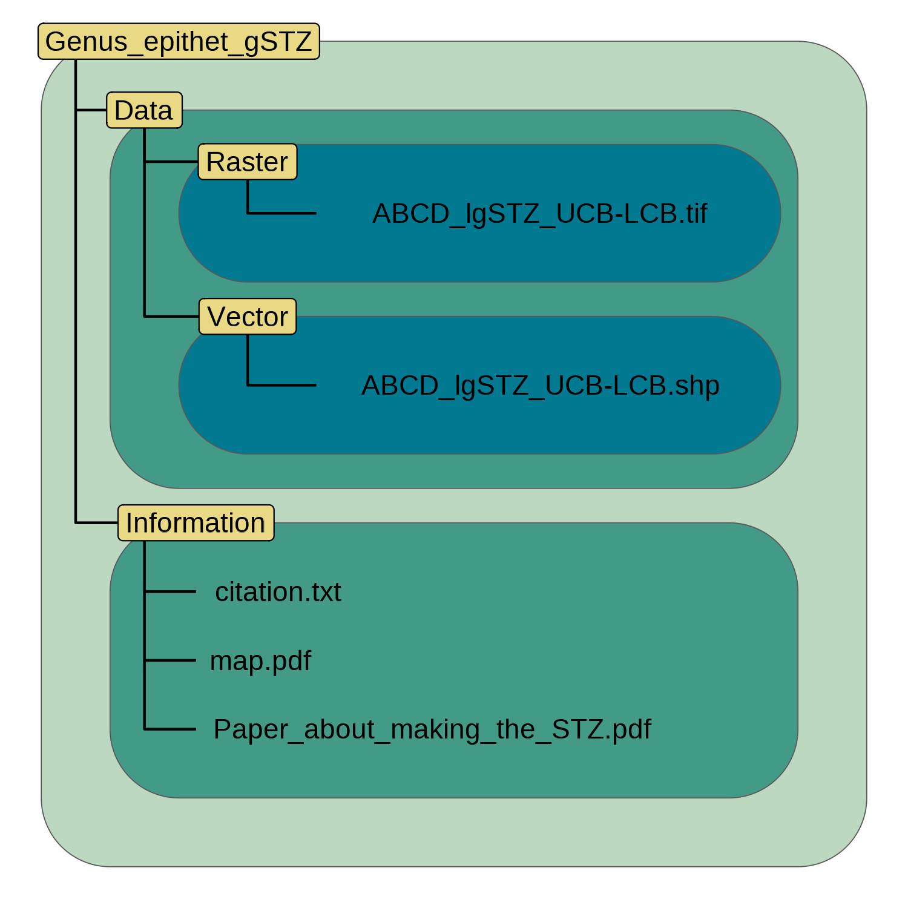
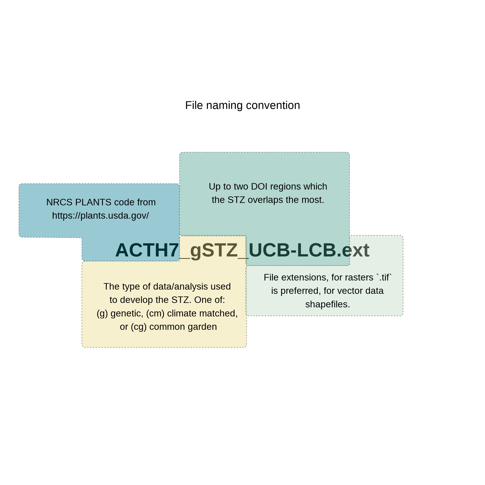

## IMPLICATIONS FOR PRACTICE:

- Developing a restoration plan in a short time period, as required after a natural disturbance, can be a stressful process. 
To decrease the chances of simple mistakes being propagated into plans we develop standards to increase consistency between eSTZs to make there usage in GIS software more consistent.  

- We implement these suggestions in an R package ‘[eSTZwritR](https://sagesteppe.github.io/eSTZwritR/)’ which should  facilitate adherence to the guidelines for the scientists developing eSTZ products, allowing for a rapid uptake of these conventions.  

- We also suggest the incorporation of estimates of uncertainty for spatial eSTZ data products so practitioners have sufficient support for selecting material from non-target seed zones as required. 

# INTRODUCTION  
{width=75%}  

Empirical seed transfer zones (eSTZs) are gaining popularity amongst restoration practitioners as a tool to help identify the most appropriate seed source for a species at a restoration site [@mckay2005local]. 
eSTZs are popular for two primary reasons 1) they are based on empirical data - e.g. the phenotypes in a common garden, population genetics, or the correlation between occurrences of the species and environmental variables 2) generally the zones are more coarse than provisional seed transfer zones thereby reducing the number of lineages requiring cultivation. 
While popular, the development of eSTZs for a species is a costly and time consuming process, most often involving common garden, or genetic studies, with many populations from across the species range incorporated as samples (@kramer2015assessing).  

In western North America, the majority of eSTZs have been developed by just a couple of lab groups, whilst the remainder have largely been developed as one-off's by other assorted lab groups. 
While standards for best practices during the development of eSTZs are becoming more defined, standards for sharing the results of eSTZs, are wanting (MASS MEE, WYOMING GUY). 
Despite eSTZs being produced by a relatively small pool of lab groups and individuals, inconsistencies vary across the spatial data products used to report eSTZs, differences which we posit are associated with a combination of individual analysts preferences, and to a lesser extent a natural evolution of the product reporting itself.  

We argue that the dissemination of data and ideas during and after restoration projects is our best opportunity to increase the results of each current and future restoration, whether it be information verbally communicated between local practitioners, or written information from studies and shared via the grey or white literature (Figure 1). 
Different ideas have varying levels of complexity which either enhance or impede their communication, for example seeding rates may be easily verbally communicated, while seed mixes require written documentation, where as spatial data require both written and spatial data products (e.g. rasters, shapefiles) to accurately convey their meaning. 
Given the relative complexity of communicating precise spatial information standards should exist to ensure not only it's accuracy and precision, but also the ease by which it can be interpreted, and used. 

Here, using 23 sets of eSTZs produced for 22 taxa, we show that most of the data developed and disseminated, to share the results of an eSTZ, are inconsistent [@doherty2017matching, @erickson2004landscape, @johnson2016linking, @johnson2010mapping, @bradley2013genetic, @johnson2015relating, @johnson2013genecology,  @johnson2012genecology,  @horning2010genecology, @johnson2017genecology, @shryock2017landscape, @massatti2020genetically, @massatti2019genetically, @massatti2020assessment]. 
We have already observed significant hindrances to the uptake of these data at the level of practitioners, and search for consensus within these data. 
Subsequently, using any consensus (wisdom of the masses) from these data, combined with standard conventions of data sharing, we present a set of guiding standards for researchers to employ to make results more consistent. 

# Current Condition
{width=50%}  

We conducted a review of all eSTZs on the Western Wildland Environmental Threat Assessment Center (WWETAC) website (https://research.fs.usda.gov/pnw/products/dataandtools/datasets/seed-zone-gis-data, as of May 1, 2024).
Each data product was analyzed for its file name structure (using 5 categories), metadata, naming conventions, and directory structure. 
All scoring was done by hand, and all analyses were carried out in R version 4.2.1.

{width=50%}

In Figures 2 through 4, we present the results which we believe to be the most likely to interfere with practitioners workflows. 
We encountered considerable inconsistency within file names (Figure 2), and in directory structure and naming (Figure 3). 
While some consensus existed around the use of USDA NRCS-Plants codes for denoting the contents of the file, the lack of files mentioning what they contained (e.g. 'zones', 'seed_zone', 'sz'), and the lack of specified geographic extents can make determining what the file contains difficult in regards to the species difficult, unless the file is opened in a Geographic Information System (GIS) software. 
Unless all users have centralized directories on their networks for all of their STZ products we propose that the current approaches offer considerable resistance to a practitioner trying to find a file within their file system using common GUI searching functionality. 

The naming of the fields (columns) within shapefiles likely presented the most problematic of all results (Figure 3), while many inconsistencies exist, here we focus on three. 
Different usages of polygon geometry types existed for representing the individual seed transfer zones, i.e. sometimes all portions of a seed transfer zone - when at least some components are disconnected - where stored within the same object or row (a multipolygon). 
Other times each discontinuous portion of the range would be stored as it's own polygon. 
For most infrequent Geographic Information System (GIS) users, we have observed that multipolygons can be confusing and require them to  
Surprisingly, within each shapefile the field denoting the Seed Zones were often unlabeled, or entirely lacking any indication; in a number of instances it took us several minutes to determine which field was the seed zone by toggling through visualizing each field. 

{width=50%}

# Recommendations 

Consensus exists among the developers of eSTZs for a range of attributes related to distribution of spatial products.
Combining those opinions with our perceived best practices for data sharing, and experience as users of each of the existing empirical products, results in the recommendations below.

### Directory Structure
{width=50%}

eSTZ’s should be distributed using a predictable directory structure allowing practitioners to be immediately familiar with where to find their desired contents (Figure XX). 
This predictable nature should decrease the time required to find particular attributes of the data. 

We recommend that all directories have two main subdirectories (Figure 5), one containing the essential data products, preferably in both raster and vector data formats. 
The other directory contains information relating to the product, including a formatted citation for data use, a map for quick reference, and any materials describing the production of the product both as a paper, and a text file of quick metadata attributes. 

### File Naming
{width=50%}  

The individual files within the directory should follow a simple naming format which is easy for users of various softwares to interpret and readily import for use, while also containing key parameters of the data product. 
We recommend (figure 6) that each file name has three main components, in addition to the file extension. 
The first component is the USDA PLANTS code, the specific taxon, and the second is the type of data used to develop the STZ, the final is the two main regions which the product overlaps. 
We strongly recommend the use of the 12 Department of Interior regions as they cover considerable geographic expanses and reflect some degree of ecological patterns. 

## Maps 
Maps should be included within the Information directory. 
Many questions about eSTZs can be answered quickly and simply from a practitioner consulting a map saved as a PDF with the essential cartographic components.
We recommend that each map contains the following elements: north arrow, scale bar, state borders, geographically relevant cities, coordinate reference system information, sensible categorical color schemes for the seed zones, a legend, the taxons name as a title, and the maps theme ('Seed Transfer Zones') as a subtitle. 

## Data Formats
We recommend that the spatial data associated with an eSTZ be distributed using both popular spatial data models, vector and raster. 
For vector data we advocate for the continued usage of data using the shapefile format, while for raster data we propose the usage of geoTIFFs (‘tifs’, the .tif extension). 
In our experience tifs seem to be the most widely used of the raster data models in ecology for non-time series data, they are widely supported by a variety of geographic information systems, and generally seem to perform better than ASCII. 

## Vector Data Field Attributes
{width=50%}  

We believe that the fields (~'columns') of the vector data should follow a predictable pattern (Figure 7). 
This will allow humans visualizing the data in a GUI to quickly visually detect their field of interest, and while it’s bad practice – allow code to subset columns by position rather than field name. 
We further recommend the standardization of field names to allow for code and scripts to retrieve these values without more complicated coding techniques. 

We recommend that each shapefile has a bare minimum of four fields in the following order and of the following data types.
1) ID (numeric - integer) a unique number associated with each individual polygon in the file, we do not recommend combining polygons into multipolygon units, as individual polygons can retain information about their area, and are easier for many users to subset. 
2) Seed Zone (numeric - integer) a unique identifier for each of the eSTZs delineated by the practitioners, these allow for quick filtering of the data based on a simple value which is hard to misspecify. 
3) SZName (character) a human developed name for the zone this may refer to a axis of a principal component analysis, e.g. 'LOW MEDIUM LOW', or be defined by the analysts. We opine that semi-informative names should be developed before data distribution to help practitioners more easily convey important attributes without having to rely on numeric values which may be more difficult to remember due to their nondescript nature. 

In addition to these standard field naming and placement conventions, we further recommend a series of standards for the contents within these essential fields, and how to format any additional fields relevant to the project. 

# Estimating Uncertainty

{width=50%}  

We have observed considerable consternation from seed collection crews, curators, and restoration practitioners alike over the ‘proper’ classification for both a seed source, and the selection of a seed source for a restoration.
In most instances these hesitations relate to a seed source which is present from a population which ‘straddles’ two or more seed zones.
We predict that with the increasing availability of fine resolution spatial data, and the wider availability of ecological relevant variables - which more accurately reflects local ecological heterogeneity - individual portions of seed zones will become more fine, increasing the perimeter to surface area ratio and thereby the prevalence of this already common phenomenon [@gibson2019importance]. 

Based on our survey we believe that eSTZs are currently distributed only as polygon vector data (e.g. shapefiles).  
Vector data convey a sense of separation between the objects they represent, i.e. they are used to represent discrete classes with meaningful borders between them. 
Common examples of polygon vector data model usage include administrative units (e.g. zip codes, states, and countries), watersheds, and the geographic range of a species. 
On the other hand raster data, or gridded surfaces, are used for representing continuous phenomena, i.e. gradients. 
Common examples of raster data model usages include climate variables, land cover classes, and predictions of species habitat suitability.

While we agree with the current prevailing consensus that in most applications, the use of the polygon vector data model is generally the preferred method of sharing data, we have frequently observed scenarios where a population crosses multiple seed zones, that we believe the usage of raster data is warranted for all reports. 
Raster data come with an enormous benefit in that they can readily incorporate multiple layers (individual raster files, or 'raster stacks') for each pixel across  a domain, thus allowing for a first layer of consensus predictions for each cell (the data conveyed in a vector data set), and a few other levels of prediction. 
For example, a raster with four layers could have the final three layers dedicated to raw model output while the first layer is consensus of these products, in the case of regression type analyses these three layers would represent predictions at the specified lower and upper confidence intervals and the model prediction, and in the case of a classification algorithm the three classes with the highest predicted probabilities.   
In the above examples the consensus layer would then be informed by the plurality of assignment between the predictions, and by the preferred prediction model (e.g. via the typical regression prediction) when no plurality exists. 

We believe that conveying these uncertainties will allow data users to understand and explore the caveats with model predictions.  
This practice is further grounded in best scientific practice as the spatial data used to develop the initial zones are imperfect, the study itself was imperfect, and the classification process is itself imperfect. 
Further on an ecological level we believe that a porosity exists between these populations of species – they are by virtue of being components of a species connected at least marginally via gene flow, and the expression of this continuity is the most appropriate course of action for data dissemination. 

# IMPLEMENTATION
The suggestions above may seem relatively onerous to carry out at the end of a multi-year study, especially when considering manuscripts are being prepared for publication and further funding opportunities are being applied for, and staff (e.g. postdocs, lab managers) may be leaving the group at the end of the project. 
For these reasons we have created an R package, eSTZwritR (‘pronounced easy rider’), which can implement all of them, less the statistical processing, with minimal user inputs. 
The package is installable on GitHub at https://github.com/sagesteppe/eSTZwritR, and a Github website (https://sagesteppe.github.io/eSTZwritR/) exists for users interested in better understanding it's functionality and which includes supplemental figures and more intricate details not discussed here. 

### FOR DEVELOPERS  
The package requires only 4-5 functions to produce a directory with the contents discussed above, with minimal data entry. 
Most importantly the entries are well outlined and easily entered without requiring close attention to detail, an omnipresent scenario when processing standards by hand.  

### FOR PRACTITIONERS  
These results should allow for simple utilization of existing empirical seed transfer zone resources. 
We have re-processed all eSTZ data products we are aware of to follow these standards, with the exception of creating the uncertainty raster layers. 
We have provided some sample code which showcases loading these data into a Geographic Information System (GIS) which utilizes either R or python coding elements, as well as the freely available QGIS which is set up with an advanced graphical user interface (GUI), which allows a user to navigate via click-and-point action.  

# CONCLUSIONS
Seed based active restoration will always be a relatively expensive, yet necessary, option for restoration.
Here we present simple standards for the scientists developing eSTZs to use in order to standardize the data products they are developing to ease their implementation. 
While these conventions should be easy to implement for a sufficiently detail oriented and interested individual, we also present an R package which can quickly achieve these results.

# LITERATURE CITED  