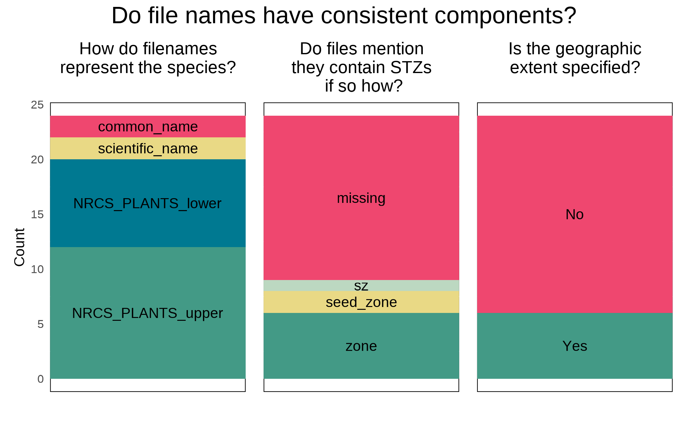
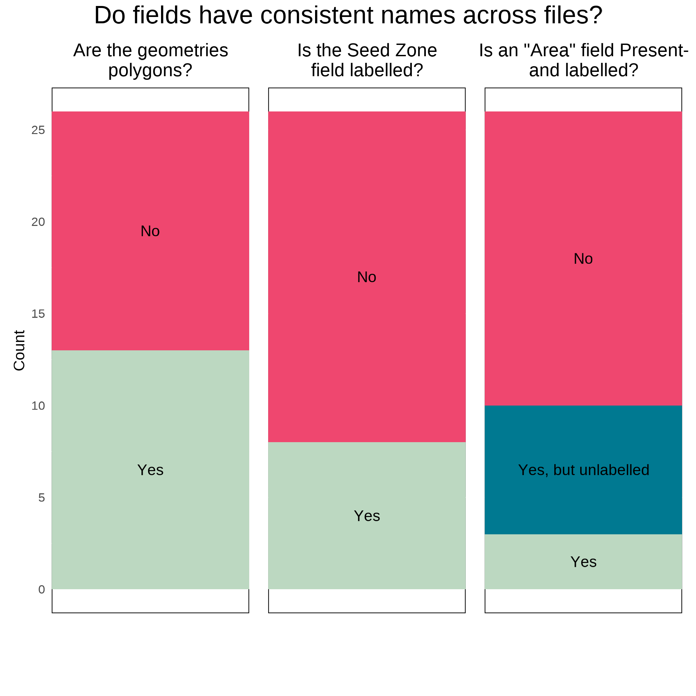
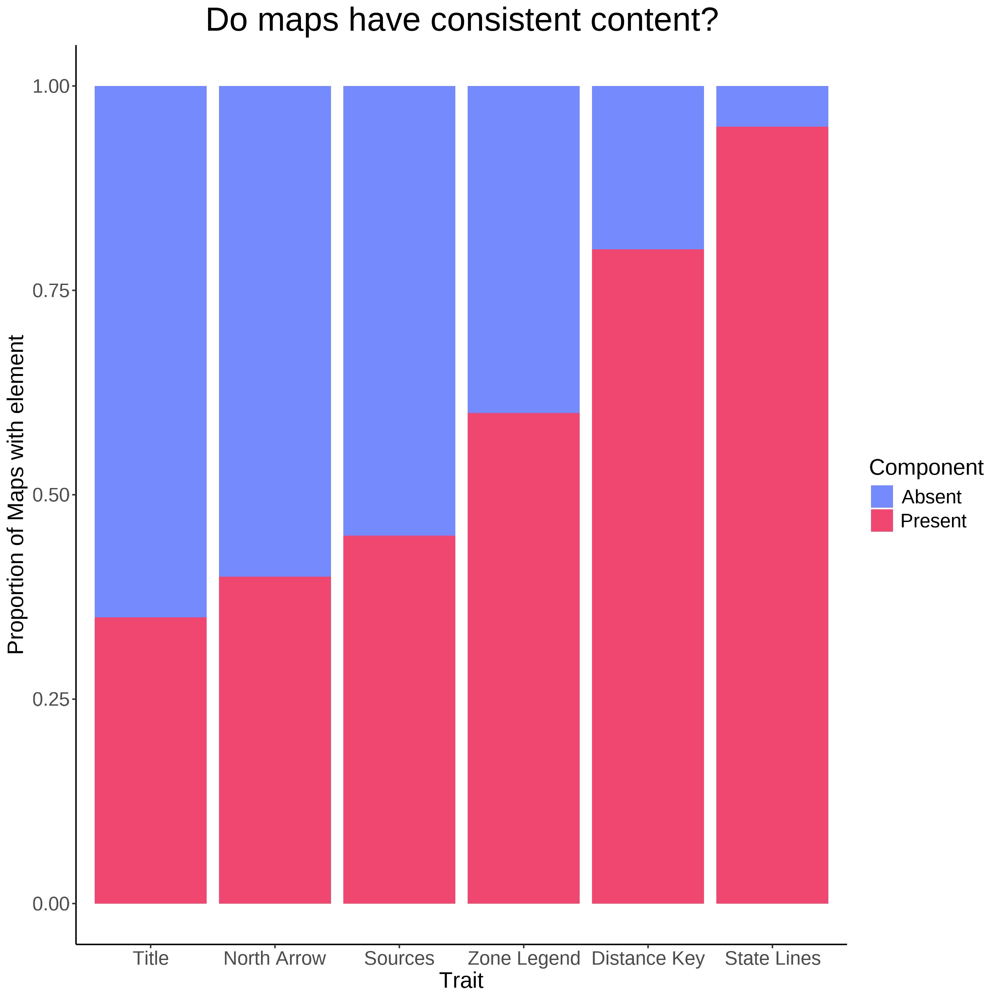
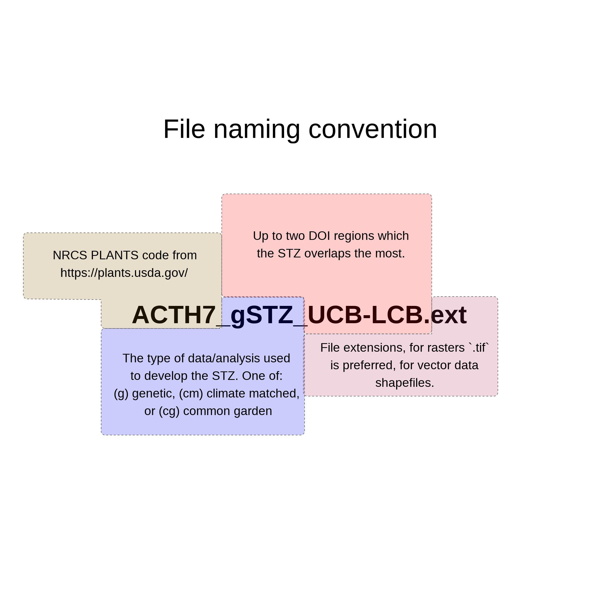

## IMPLICATIONS FOR PRACTICE:

- Developing a restoration plan in a short time period, as required after a natural disturbance, can be  difficult. 
To decrease the chances of simple mistakes being introduced into plans, we developed standards to increase the consistency between eSTZ data products, making their usage in GIS software more consistent. 

- We implement these suggestions in an R package ‘[eSTZwritR](https://sagesteppe.github.io/eSTZwritR/)’ which should facilitate adherence to the guidelines for scientists developing eSTZ products, allowing for a rapid uptake of these conventions.  

- We also suggest incorporating estimates of uncertainty for spatial eSTZ data products so that practitioners have sufficient support for selecting materials from non-target seed zones, as is often required.  

# INTRODUCTION  
![Dissemination. The first three panels ('collections', 'common garden', 'analysis') indicate the process of developing an eSTZ, while the 'dissemination' panel showcases the need to share results so they can  inform operational seed collections, agricultural increase, and selection of materials for a restoration. Note that 'common garden' represents the act of eSTZ development, but could be replaced with molecular work to develop a genetic product, or modelling for a climate matched product. By Emily Woodworth](./figures/Wu-naut.jpg){width=75%}  

Empirical seed transfer zones (eSTZs) are gaining popularity among restoration practitioners as tools to help identify the most appropriate seed source for a species at a restoration site [@mckay2005local]. 
eSTZs are becoming more widely used for two primary reasons: 1) they are based on empirical data, such as phenotypes in a common garden, population genetics, or the correlation between occurrences of the species and environmental variables; and 2) their are generally fewer zones than provisional seed transfer zones, thereby reducing the number of lineages requiring cultivation in agricultural settings. 
Although popular, the development of eSTZs for a species is a costly and time-consuming process, most often involving common gardens or genetic studies, with many populations from across the species range incorporated as samples [@kramer2015assessing].   

In western North America, the majority of eSTZs have been developed by just a couple of lab groups, whereas the remainder have been developed by other assorted groups. 
While practices for developing eSTZs are becoming more defined, to our knowledge, no standards exist for *sharing* eSTZ results (Supplemental 1). 
Although eSTZs are produced by a relatively small pool of lab groups and individuals, inconsistencies vary across the spatial data products used to report eSTZs.

The success of a restoration project relies on the timely application of techniques suitable for the site at hand. 
The implementation of relevant techniques requires not only intrapersonal communication between a practitioner and themselves in time, for example avid note-taking, but also interpersonal communication between practitioners. 
Hence, the dissemination of ideas during and after a restoration project is the best opportunity to improve restoration outcomes (Figure 1). 
However, ideas have varying levels of complexity that may hinder their transmission.  
For example, seeding rates may be verbally communicated, while seed mixes are likely to require written documentation, spatial data require both written and geographic data (e.g., coordinates and relations between them) in the form of spatial data products (e.g., rasters and shapefiles) to accurately convey their meaning. 
Given the relative complexity of communicating precise spatial information, standards should exist to ensure not only its accuracy and precision, but also its ease of interpretation and use. 

Using 23 sets of eSTZs produced for 22 taxa, we showed that most of the spatial data developed and disseminated to share the results of an eSTZ are inconsistent (Supplemental 1). 
We have already observed significant hindrances to the uptake of these data at the practitioner level and searched for consensus within these data. 
Subsequently, using any consensus (wisdom of the masses) from these data combined with standard conventions of data sharing, we present a set of guiding standards for researchers in the United States to make the results more consistent.   

# Current Condition
{width=50%}  

We conducted a review of all eSTZs on the Western Wildland Environmental Threat Assessment Center (WWETAC) website as of May 1, 2024 (https://research.fs.usda.gov/pnw/products/dataandtools/datasets/seed-zone-gis-data).
Each data product (file name structure, field naming conventions, and directory structure) was manually scored, and all analyses were performed in R version 4.2.1.

{width=50%}

In Figures 2 through 4, we present inconsistencies that we believe or have observed to be the most likely to interfere with practitioners' workflows. 
We encountered considerable inconsistencies within file names (Figure 2), in directory structure and naming (Figure 3), and cartographic elements of the 20 maps available (Figure 4). 
While some consensus existed around the use of USDA NRCS-Plants codes for denoting the taxon contained in the file (Figure 2), the lack of file names mentioning what attribute about the taxon they contained (e.g. 'zones, ' ‘seed_zone, ' ‘sz'), and the lack of specified geographic extents can make determining the specifics of the file difficult unless it is explicitly opened in a Geographic Information System (GIS) software.  

The naming of the fields (columns) within shapefiles likely presented the most problematic of all results (Figure 3), although many  inconsistencies exist; here, we focus on three. 
Different uses of polygon geometry were implemented to represent the individual seed transfer zones, that is, sometimes all portions of a seed transfer zone, when at least some components are disconnected, where stored within the same object or row (a multipolygon). 
At other times, each discontinuous portion of the range was stored as its own polygon. For most infrequent Geographic Information System (GIS) users, we observed that multipolygons can be confusing and require them to use several moderately advanced spatial techniques to interact with. 
Surprisingly, within each shapefile, the field denoting the seed zones was often ambiguously labelled or entirely lacking any indication (Figure 3).
In several instances, it took several minutes to determine which field was the seed zone by toggling through and visualizing many fields, despite having already been interfaced with all of these products multiple times.  

{width=50%}

# Recommendations 

Some consensus exists among eSTZ developers for a range of attributes related to the distribution of data products.  Combining these opinions with best practices for data sharing and experience as users of each of the existing empirical products results in the following recommendations. 

### Directory Structure
{width=50%}

eSTZs should be distributed using a predictable directory structure that allows users to be immediately familiar with where to find  the content (Figure 5).  
We recommend that all directories (folders) have two main subdirectories (Figure 5), one containing the essential data products, preferably in both raster and vector Data Formats (*see 'Data Formats'*).  
The second directory contains information related to the product, including a formatted citation for data use, a map for quick reference, and any materials describing the development of the product, both as a paper and a text file of quick metadata attributes.  

### File Naming
{width=50%}  

The files within the directory should follow a naming convention that is easy for users to interpret and import to various software while also describing the essential attributes of the data product.  
We recommend (Figure 6) that each file name has three main components in addition to the file extension.  The first component is the USDA PLANTS code, and the second is the method used to develop the STZ - currently one of 'g', 'cg', 'cm' (for genetic, common garden, and climate matched, respectively), and the final is up to the two main regions which the product overlaps.  
In the United States, we recommend the use of the 12 Department of Interior regions as they cover contiguous geographic expanses, are few enough to be easily remembered, and balance L2 Omernik ecoregions with easier to remember state lines. 
However, in other nations, the use of ecoregions may be more desirable.  

## Maps 
Maps of the data product should be included in the 'Information' directory. 
Many questions about eSTZs can be answered quickly and simply by a practitioner consulting a map saved as a PDF with the essential cartographic components; fortunately most developers already supply these. 
We recommend that each map contains the following elements: north arrow, scale bar, state borders, geographically relevant cities, coordinate reference system information, sensible categorical color schemes for the seed zones (e.g. from ColorBrewer https://colorbrewer2.org), a legend, the taxons name as a title, and the maps theme ('Seed Transfer Zones') as a subtitle. 

## Data Formats
We recommend that the spatial data associated with an eSTZ be distributed using both popular spatial data models, vector and raster. 
For vector data, we advocate the continued usage of the shapefile format, whereas for raster data, we propose the use of geoTIFFs (‘tifs,’ the. tif extension). 
In our experience, tifs seem to be the most widely used raster data models in ecology for non-time series data, and are  supported by virtually all GIS software.   

## Vector Data Field Attributes
{width=50%}  

The order of the fields (or columns) of the vector data should follow a predictable pattern (Figure 7), allowing humans to interact with the data in a graphical user interface (GUI) to quickly detect their field of interest. 

We recommend that each shapefile have at least four fields in the following order and of the following data types.
1) The numeric integer (ID) is a unique number associated with each individual polygon in the file.  
2) Seed Zone (numeric integer) is a unique identifier for each of the eSTZs delineated by the product developers, which allows for quick filtering of the data based on a simple numeric value that is difficult to misspecify. 
3) SZName (character): a human-developed name for the zone that may refer to an axis of a principal component analysis, for example, 'LOW MEDIUM LOW', or be defined by the product developers. We propose that semi-informative names should be developed before data distribution to help practitioners more easily convey important attributes without relying on numeric values, which may be more difficult to remember because of their nondescriptive nature.  
4) AreaAcres (numeric - integer) of each polygon.  

In addition to these standard field naming and placement conventions, we recommend a series of standards for the contents within these essential fields and how to format any additional fields relevant to the project (see package website).  

## Adapting our Proposals to other Regions
We believe that our core set of proposals is readily adaptable to a variety of regions globally.  However, some modifications are required to ensure a seamless implementation.
Notably, our suggestions for file names contain three parts, two of which are specific to data sources limited in scope to the United States. 
The first is the use of a set of abbreviated codes that reliably identifies a plant taxon ('NRCS PLANTS code').
The second is the use of administrative ('DOI') regions for denoting a general geographic area which the specific product covers. 
An alternative solution that we considered for the US States is the use of ecoregions. 
However, this was rejected because of the number of ecoregions (e.g., 10 conterminous US DOI regions to 20 level 2 Omernik ecoregions) and, most importantly, because many ecoregions are not contiguous, which may lead to confusion.
Possible alternatives should be evaluated based on the above points before they are selected for use.  

Additionally, we believe that many other countries may be able to immediately start distributing their vector data as an OGC GeoPackage ('.gpkg') files rather than shapefiles. 
The GeoPackage format is a geodatabase (SQLite Database file) and an open-source standard that entails all data being stored in a single file (relative to the several files a shapefile requires), contains projection data, and contains spatially indexed data.
In fact, the data associated with 'eSTZwritR' are all shared as GeoPackage files, and anecdotal evidence suggests that its utilization by US Government agencies is increasing.  

For the US, we suggest that seed zones have numeric representations following a generally decreasing pattern in aridity because the success of restorations often follows this gradient [@shriver2018adapting]. 
However, in other regions, other climatic conditions may be more important drivers of restoration outcomes, and they should be used instead of this variable.  

# Estimating Uncertainty

{width=50%}  

We have witnessed confusion from seed collection crews, curators, and restoration practitioners alike over the appropriate classification for a new seed source and the selection of a seed source for a restoration. 
Generally, these hesitations relate to a source located on the border of multiple seed zones. 
We predict that with the increasing availability of fine-resolution spatial data that more accurately reflect local ecological heterogeneity-seed zones will become finer, increasing the perimeter-to-surface area ratio and the prevalence of this already common confusion [@gibson2019importance].  

Currently, eSTZs are distributed exclusively as polygon vector data (e.g., shapefiles). 
Vector data convey a sense of separation between the entities they represent, that is, they are composed of mutually exclusive categories with discrete borders between them. 
Common examples of polygon vector data usage include administrative units (e.g., zip codes, states, and countries), watersheds, and the geographic range of a species. 
Raster data, or gridded surfaces, are used to represent continuous phenomena, that is, gradients.  Common examples of raster data usage include climate variables, land cover classes, and predictions of species-modeled habitat suitability.  

Although we agree with the consensus that vector data are generally the best method of distributing data, given the number of times we have observed classification confusion, we believe that the inclusion of raster data is also warranted. 
Raster data have an additional benefit that they can intuitively incorporate multiple layers (a 'raster stack') for each of their pixels (although this functionality is easily achievable with GeoPackages). 
This allows for the first layer of consensus predictions (the data conveyed in a vector dataset) and other levels of raw predictions.
As a simple example, a raster with four layers would have three layers of raw model output, while the final layer is a consensus of these products. 
In the case of regression-type analyses, two layers could represent predictions at the lower and upper confidence intervals, and the final layer could represent a model prediction, whereas in the case of a classification algorithm, the three classes with the highest predicted probabilities and a consensus class would be present.  

We believe that conveying these uncertainties will allow users to better understand and explore caveats using model predictions. 
This practice is further grounded in best scientific practice because the spatial data used to develop the initial zones are imperfect representations of the modelled phenomenon itself, which introduces a variety of errors, and the classification (modelling) process itself is a generalization [@ascough2008future; @li20181; @lechner2012landscape].  

A meta-analysis of genetic data sets, collected over large spatial domains in Western North America, found that the probability of mixing populations of more distantly related evolutionary lineages (i.e. different clusters, or *K*, identified by STRUCTURE analyses) increases as a function of distance between the prospective populations [@massatti2020assessment]. 
These analyses suggest that to avoid the possibility of outbreeding depression at a restoration site the most appropriate seed source will likely be the most proximate source, relative to a more distal source from within the same pSTZ. 
This work provides a precedent which supports restoration ecologists in leaning towards using closer, rather than further away seed sources even if they are located within the same seed zone; combining the above findings with metrics of uncertainty from eSTZ classifications will further bolster decision making. 

The use of raster surfaces are already implemented in the Seedlot Selection Tool and Climate-Smart Restoration Tool, which blend attributes of pSTZs and eSTZs, or can be used to select the most appropriate eSTZ based seed source factoring in observed and forecast (e.g. RCP pathways) climatic values and custom functions [@st2022seedlot]. 
These tools offer both an alternative format for guiding native germplasm development (e.g. spatially where should germplasm be developed from?) via gap analysis, and especially for choosing a priority seed source for a restoration when multiple are available. 
However, one drawback of the existing implementation of these tools is that they calculate climate similarity from a single focal cell, e.g. a restoration site, to the entire surface. 
In many instances seed lots need to be developed *before* a restoration site is known, for example in the case of reseeding severe disturbances (e.g. wildfires). 
Combining the development of seed sources within zones, which allows for decision making to develop seed availability, with the Climate-Smart Restoration Tool to select potential seed source options after a natural disaster may lead to the most pragmatic decisions.  

# IMPLEMENTATION

## Software

To make these suggestions easy to implement we have created an R package, eSTZwritR (pronounced 'easy rider'), which can implement all of them, less the statistical processing, with minimal user inputs. 
The package is installable from GitHub https://github.com/sagesteppe/eSTZwritR and has a GitHub Pages website (https://sagesteppe.github.io/eSTZwritR/) for users interested in better understanding its functionality, and which includes supplemental figures and details not discussed here. 

### FOR DEVELOPERS
The package requires only 5 functions to produce a directory with the contents discussed above, with minimal data entry. 
Most importantly, the entries are well outlined and easily entered without requiring close attention to detail.  

### FOR PRACTITIONERS
These results should allow for simple utilization of existing empirical seed-transfer zone resources. 
We have re-processed all eSTZ data products that we are aware of following these standards, with the exception of creating uncertainty raster layers. 
We provided some sample code that showcases loading these data into a non-GUI GIS on the website above.   

# CONCLUSIONS
Seed-based active restoration will always be a relatively expensive yet necessary option for terrestrial restoration. 
Here, we present simple standards for scientists developing eSTZs to use in order to standardize the data products they are developing to assist in their uptake. 
Although these conventions should be easy to implement for a sufficiently motivated individual, we also present an R package that can quickly achieve these results.  

# ACKNOWLEDGEMENTS
Two anonymous reviewers are thanked for their constructive comments on this manuscript. 

# DATA AVAILABILITY STATEMENT
The scored data for the analysis, and post processed eSTZ data sets are openly available on Dryad at ... (doi)... reference number ... 

## Term box
Seed transfer zones are intended to improve restoration outcomes by decreasing the chances of using maladapted seeds at a restoration site [@kramer2009plant].
They seek to characterize (empirically) or estimate (provisionally) local adaption and aim to minimize the variation between prospective seed sources and restoration sites [@leimu2008meta; @kramer2009plant]. 
Provisional seed transfer zones (pSTZs) can be utilized across all vascular plants and are based on the similarity between several climate variables known to be broadly relevant to plant life in a region (e.g., in the US). Winter Minimum Temperature, and Annual Heat:Moisture index) [@bower2014generalized]. 
eSTZs have the same goal as pSTZs but are tailored for individual species, allowing for more accurate determination of zones in which seeds can be transferred under existing climate regimes.  

The development of seed transfer zones in the US can be traced back to the 1960s when forestry companies, which had to replant timber stands after logging, developed guidance to ensure the success of their re-plantings [@johnson2004pacific].
However, it was not until the early 21^st^ century that researchers began developing STZs for other groups of plants in the US [@mckay2005local], in part because of the increasing size of large wildfires and demand for locally adapted seeds [@national2023assessment]."
**Tandem to the development of STZs for non-tree species in the US has been the development of STZs in both Europe [@johnson2004pacific].* 

# LITERATURE CITED  

