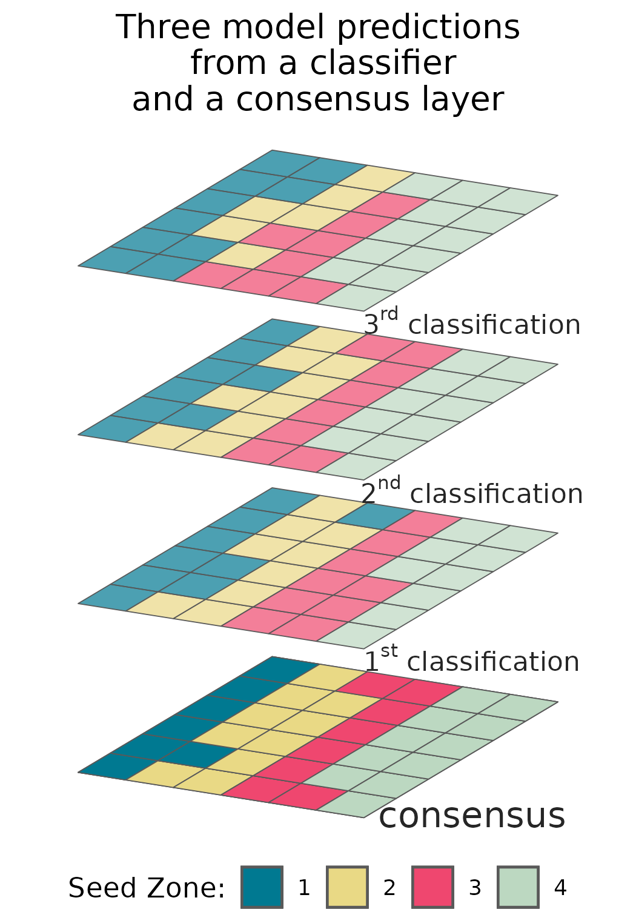

## IMPLICATIONS FOR PRACTICE:

- Developing a restoration plan in a short time period, as required after a natural disturbance, can be a stressful process. 
To decrease the chances of simple mistakes being introduced into plans, we develop standards to increase the consistency between eSTZ data products making their usage in GIS software more consistent.  

- We implement these suggestions in an R package ‘[eSTZwritR](https://sagesteppe.github.io/eSTZwritR/)’ which should facilitate adherence to the guidelines for scientists developing eSTZ products, allowing for a rapid uptake of these conventions.  

- We also suggest incorporating estimates of uncertainty for spatial eSTZ data products so practitioners have sufficient support for selecting material from non-target seed zones as is often required. 

# INTRODUCTION  
![Dissemination. The first three panels ('collections', 'common garden', 'analysis') indicate the process of developing an eSTZ, while the 'dissemination' panel showcases the need to share results so they can  inform operational seed collections, agricultural increase, and selection of materials for a restoration. Note that 'common garden' represents the act of eSTZ development, but could be replaced with molecular work to develop a genetic product, or modelling for a climate matched product. By Emily Woodworth](./figures/Wu-naut.jpg){width=75%}  

Empirical seed transfer zones (eSTZs) are gaining popularity amongst restoration practitioners as a tool to help identify the most appropriate seed source for a species at a restoration site [@mckay2005local]. 
eSTZs are popular for two primary reasons 1) they are based on empirical data - e.g. the phenotypes in a common garden, population genetics, or the correlation between occurrences of the species and environmental variables and 2) generally the zones are more coarse than provisional seed transfer zones thereby reducing the number of lineages requiring cultivation in agricultural settings. 
While popular, the development of eSTZs for a species is a costly and time consuming process, most often involving common garden or genetic studies, with many populations from across the species range incorporated as samples [@kramer2015assessing].  

In western North America, the majority of eSTZs have been developed by just a couple of lab groups, whilst the remainder have been developed by other assorted groups. 
While standards for the best practices during the development of eSTZs are becoming more defined, no standards exist for *sharing* the results of eSTZs. 
Despite eSTZs being produced by a relatively small pool of lab groups and individuals, inconsistencies vary across the spatial data products used to report eSTZs.  

The success of a restoration project relies on the timely application of techniques which are suitable for the site at hand. 
Implementation of relevant techniques requires not only intrapersonal communication between a practitioner with themselves in time, e.g. avid note taking, but also interpersonal communication between practitioners. 
Hence the dissemination of ideas during and after a restoration project is our best opportunity to improve the outcomes of restorations (Figure 1). 
However, ideas have varying levels of complexity which may hinder their transmittal. 
For example seeding rates may be verbally communicated, while seed mixes are likely to require written documentation, whereas spatial data require both written and geographic data (e.g. coordinates and relations between them) in the form of spatial data products (e.g. rasters, shapefiles) to accurately convey their meaning. 
Given the relative complexity of communicating precise spatial information standards should exist to ensure not only its accuracy and precision, but also the ease by which it can be interpreted and used. 

Using 23 sets of eSTZs produced for 22 taxa, we show that most of the spatial data developed and disseminated, to share the results of an eSTZ, are inconsistent ([@doherty2017matching], [@erickson2004landscape], [@johnson2016linking], [@johnson2010mapping], [@bradley2013genetic], [@johnson2015relating], [@johnson2013genecology],  [@johnson2012genecology],  [@horning2010genecology], [@johnson2017genecology], [@shryock2017landscape], [@massatti2020genetically], [@massatti2019genetically], [@massatti2020assessment]). 
We have already observed significant hindrances to the uptake of these data at the level of practitioners, and search for consensus within these data. 
Subsequently, using any consensus (wisdom of the masses) from these data, combined with standard conventions of data sharing, we present a set of guiding standards for researchers to employ in making results more consistent. 

# Current Condition
{width=50%}  

We conducted a review of all eSTZs on the Western Wildland Environmental Threat Assessment Center (WWETAC) website as of May 1, 2024 (https://research.fs.usda.gov/pnw/products/dataandtools/datasets/seed-zone-gis-data).
Each data products: file name structure, field naming conventions, and directory structure, were manually scored, and all analyses were carried out in R version 4.2.1.

{width=50%}

In Figures 2 through 4, we present inconsistencies which we believe, or have observed to be, the most likely to interfere with practitioners' workflows. 
We encountered considerable inconsistency within file names (Figure 2), in directory structure and naming (Figure 3), and cartographic elements of maps (Figure 4). 
While some consensus existed around the use of USDA NRCS-Plants codes for denoting the taxon contained in the file (Figure 2), the lack of file names mentioning what attribute about the taxon they contained (e.g. 'zones', 'seed_zone', 'sz'), and the lack of specified geographic extents can make determining the specifics of the file difficult unless it is explicitly opened in a Geographic Information System (GIS) software. 

The naming of the fields (columns) within shapefiles likely presented the most problematic of all results (Figure 3), while many  inconsistencies exist, here we focus on three. 
Different usages of polygon geometry were implemented for representing the individual seed transfer zones, i.e. sometimes all portions of a seed transfer zone - when at least some components are disconnected - where stored within the same object or row (a multipolygon). 
Other times, each discontinuous portion of the range would be stored as its own polygon. 
For most infrequent Geographic Information System (GIS) users, we have observed that multipolygons can be confusing and require them to use several moderately advanced spatial techniques to interact with. 
Surprisingly, within each shapefile the field denoting the seed zones was often ambiguously labelled, or entirely lacking any indication (Figure 3). In a number of instances it took us several minutes to determine which field was the seed zone by toggling through and visualizing many fields, despite us already having interfaced with all of these products multiple times. 

{width=50%}

# Recommendations 

Some consensus exists among the developers of eSTZs for a range of attributes related to distribution of data products.
Combining those opinions with best practices for data sharing, and experience as users of each of the existing empirical products, results in the following recommendations. 

### Directory Structure
{width=50%}

eSTZs should be distributed using a predictable directory structure allowing users to be immediately familiar with where to find  content (Figure 5). 
We recommend that all directories (folders) have two main subdirectories (Figure 5), one containing the essential data products, preferably in both raster and vector data formats (*see 'Data Formats'*). 
The second directory contains information relating to the product, including a formatted citation for data use, a map for quick reference, and any materials describing the development of the product both as a paper, and a text file of quick metadata attributes. 

### File Naming
{width=50%}  

The files within the directory should follow a naming convention which is easy for users to interpret and import to various software's, while also describing essential attributes of the data product. 
We recommend (Figure 6) that each file name has three main components, in addition to the file extension. 
The first component is the USDA PLANTS code, and the second is the method used to develop the STZ - currently one of 'g', 'cg', 'cm' (for genetic, common garden, and climate matched, respectively), and the final is up to the two main regions which the product overlaps. 
In the United States we recommend the use of the 12 Department of Interior regions as they cover contiguous geographic expanses, are few enough they can easily be remembered, and balance L2 Omernik ecoregions and easier to remember state lines. 
However, we recognize that in other nations the use of ecoregions may be more desirable. 

## Maps 
Maps of the data product should be included within the 'Information' directory. 
Many questions about eSTZs can be answered quickly and simply from a practitioner consulting a map saved as a PDF with the essential cartographic components.
We recommend that each map contains the following elements: north arrow, scale bar, state borders, geographically relevant cities, coordinate reference system information, sensible categorical color schemes for the seed zones (e.g. from colorbrewer https://colorbrewer2.org), a legend, the taxons name as a title, and the maps theme ('Seed Transfer Zones') as a subtitle. 

## Data Formats
We recommend that the spatial data associated with an eSTZ be distributed using both of the popular spatial data models, vector and raster. 
For vector data we advocate for the continued usage of the shapefile format, while for raster data we propose the usage of geoTIFFs (‘tifs’, the .tif extension). 
In our experience tifs seem to be the most widely used of the raster data models in ecology, for non-time series data, and are  supported by virtually all GIS software.   

## Vector Data Field Attributes
{width=50%}  

The order of the fields (or columns) of the vector data should follow a predictable pattern (Figure 7), allowing humans interacting with the data in a graphical user interface (GUI) to quickly detect their field of interest, and while it’s bad practice – allow users code to subset columns by position rather than field name. 

We recommend that each shapefile has at least four fields in the following order and of the following data types.
1) ID (numeric - integer) a unique number associated with each individual polygon in the file. 
2) Seed Zone (numeric - integer) a unique identifier for each of the eSTZs delineated by the product developers, these allow for quick filtering of the data based on a simple numeric value which is hard to misspecify. 
3) SZName (character) a human developed name for the zone which may refer to an axis of a principal component analysis, e.g. 'LOW MEDIUM LOW', or be defined by the product developers. 
We propose that semi-informative names should be developed before data distribution to help practitioners more easily convey important attributes without having to rely on numeric values which may be more difficult to remember due to their nondescript nature. 
4) AreaAcres (numeric - integer) of each polygon. 

In addition to these standard field naming and placement conventions, we further recommend a series of standards for the contents within these essential fields, and how to format any additional fields relevant to the project (see package website).  

# Estimating Uncertainty

{width=50%}  

We have witnessed confusion from seed collection crews, curators, and restoration practitioners alike, over the appropriate classification for a new seed source, and the selection of a seed source for a restoration.
Generally, these hesitations relate to a source which is on the border of multiple seed zones.
We predict that with the increasing availability of fine resolution spatial data which more accurately reflect local ecological heterogeneity - seed zones will become more fine, increasing the perimeter to surface area ratio and the prevalence of this already common confusion [@gibson2019importance]. 

Currently eSTZs are distributed exclusively as polygon vector data (e.g. shapefiles). 
Vector data convey a sense of separation between the entities they represent, i.e. discrete classes with hard borders between them. 
Common examples of polygon vector data usage include: administrative units (e.g. zip codes, states, and countries), watersheds, and the geographic range of a species. 
Whereas raster data, or gridded surfaces, are used for representing continuous phenomena, i.e. gradients. 
Common examples of raster data usages include climate variables, land cover classes, and predictions of modelled species habitat suitability.

While we agree with the consensus that vector data are generally the best method of distributing data, given the number of times we have observed classification confusion we believe the inclusion of raster data is always warranted. 
Raster data have an additional benefit that they can intuitively incorporate multiple layers (a 'raster stack') for each of their pixels. 
Thus allowing for a first layer of consensus predictions (the data conveyed in a vector data set), and other levels of raw predictions. 
For example, a raster with four layers would have three layers of raw model output while the final layer is a consensus of these products. 
In the case of regression type analyses two layers could represent predictions at the lower and upper confidence intervals and the final layer a model prediction, while in the case of a classification algorithm the three classes with the highest predicted probabilities and a consensus class would be present. 

We believe that conveying these uncertainties will allow users to understand and explore the caveats with model predictions. 
This practice is further grounded in best scientific practice as the spatial data used to develop the initial zones are imperfect, the study itself was imperfect, and the classification process is itself imperfect. 

# IMPLEMENTATION
To make these suggestions easy to implement we have created an R package, eSTZwritR (pronounced 'easy rider'), which can implement all of them, lessen the statistical processing, with minimal user inputs. 
The package is installable from GitHub https://github.com/sagesteppe/eSTZwritR, and has a GitHub pages website (https://sagesteppe.github.io/eSTZwritR/) for users interested in better understanding it's functionality and which includes supplemental figures and details not discussed here. 

### FOR DEVELOPERS
The package requires only 5 functions to produce a directory with the contents discussed above, with minimal data entry. 
Most importantly the entries are well outlined and easily entered without requiring close attention to detail, an omnipresent scenario when processing standards by hand.  

### FOR PRACTITIONERS
These results should allow for simple utilization of existing empirical seed transfer zone resources. 
We have re-processed all eSTZ data products we are aware of to follow these standards, with the exception of creating the uncertainty raster layers. 
We have provided some sample code which showcases loading these data into a non-GUI GIS at the website above.  

# CONCLUSIONS
Seed based active restoration will always be a relatively expensive, yet necessary, option for terrestrial restoration.
Here we present simple standards for the scientists developing eSTZs to use in order to standardize the data products they are developing to assist in their uptake. 
While these conventions should be easy to implement for a sufficiently motivated individual, we also present an R package which can quickly achieve these results. 

# ACKNOWLEDGEMENTS
Two anonymous reviewers are thanked for their constructive comments on this manuscript. 

# LITERATURE CITED  